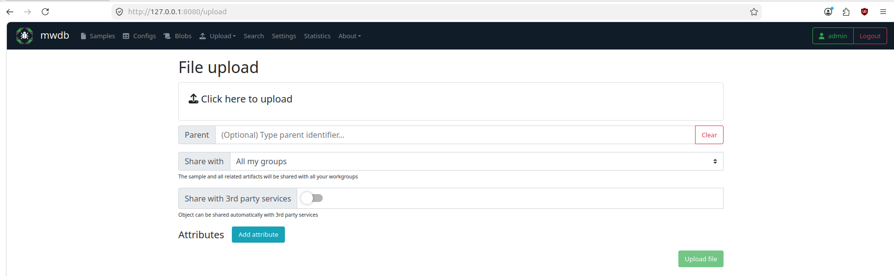
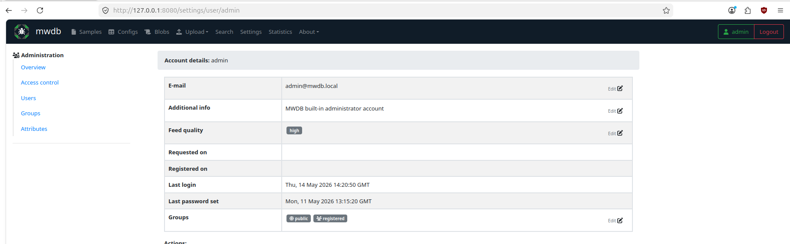
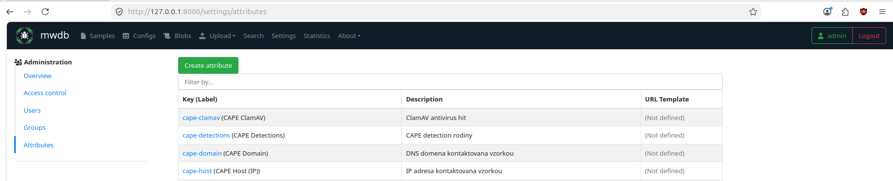
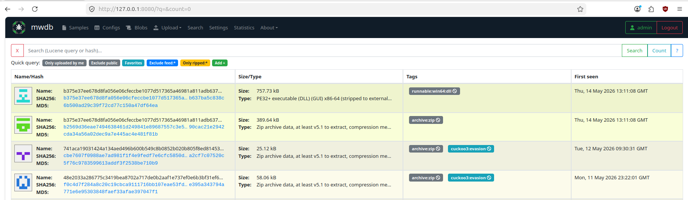
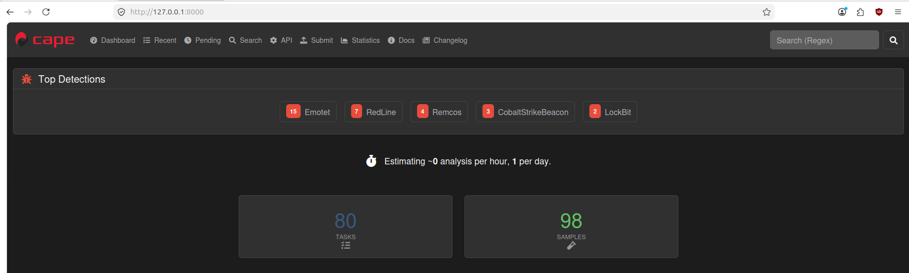
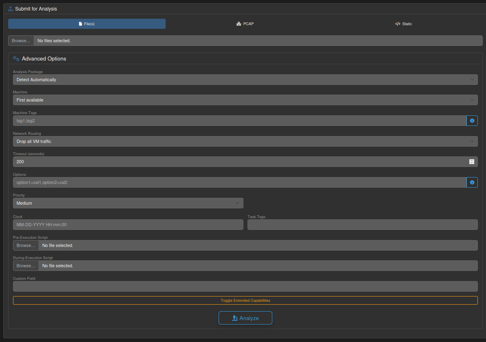
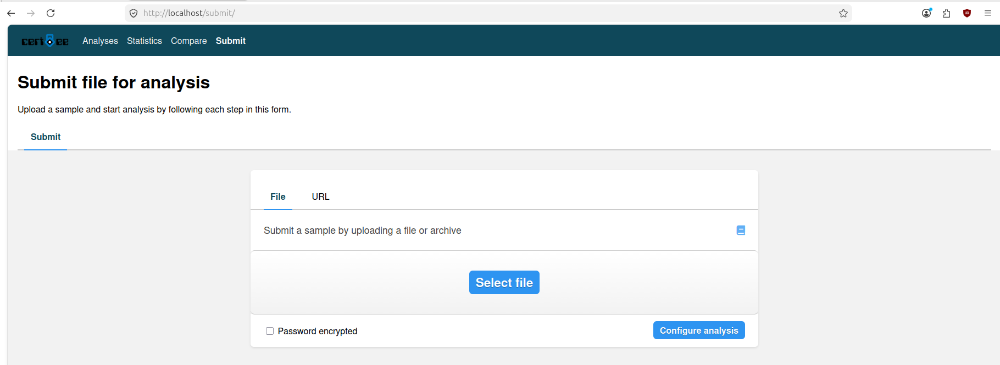
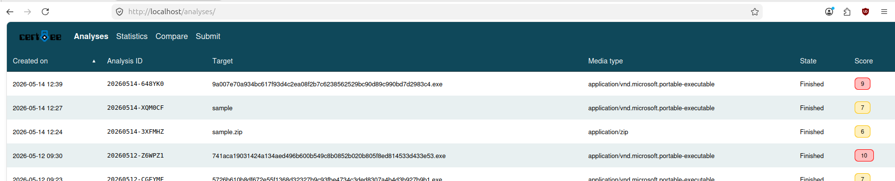

# Používateľská príručka

Táto príručka popisuje základnú prácu s troma nástrojmi, ktoré tvoria jadro automatizovaného pipeline-u na analýzu malvéru: **MWDB**, **CAPE Sandbox** a **Cuckoo3**. Pre každý nástroj sú vysvetlené kroky od nahratia vzorky až po zobrazenie výsledkov analýzy.

---

## Obsah

1. [MWDB](#1-mwdb)
   1.1 [Nahratie vzorky](#11-nahratie-vzorky)
   1.2 [Pridanie atribútu cez admin panel](#12-pridanie-atribútu-cez-admin-panel)
   1.3 [Zobrazenie detailu vzorky](#13-zobrazenie-detailu-vzorky)
2. [CAPE Sandbox](#2-cape-sandbox)
   2.1 [Odoslanie vzorky na analýzu](#21-odoslanie-vzorky-na-analýzu)
   2.2 [Zobrazenie detailu analýzy](#22-zobrazenie-detailu-analýzy)
3. [Cuckoo3](#3-cuckoo3)
   3.1 [Odoslanie vzorky na analýzu](#31-odoslanie-vzorky-na-analýzu)
   3.2 [Zobrazenie detailu analýzy](#32-zobrazenie-detailu-analýzy)

---

## 1. MWDB

**MWDB (Malware Database)** je centrálne úložisko vzoriek a metadát.

### 1.1 Nahratie vzorky

Pre manuálne nahratie sa v hornej navigácii klikne na položku **Upload**. Otvorí sa stránka **File upload**:

Postup:

1. Kliknutím na pole **Click here to upload** sa otvorí dialóg na výber súboru z disku.
2. Voliteľne je možné vyplniť pole **Parent** — identifikátor (SHA256) nadradenej vzorky, ak ide o derivát existujúceho vzorku v databáze.
3. V poli **Share with** sa určuje, s ktorými skupinami bude vzorka zdieľaná.
4. Prepínač **Share with 3rd party services** zapína automatické zdieľanie s externými službami.
5. V sekcii **Attributes** je možné už pri nahratí pridať vlastné atribúty cez tlačidlo **Add attribute**.
6. Nahratie sa potvrdí zeleným tlačidlom **Upload file** v pravom dolnom rohu.

Po úspešnom nahratí MWDB automaticky vypočíta SHA256, MD5 a SHA1 hash vzorky a presmeruje na detail vzorky.

### 1.2 Pridanie atribútu cez admin panel

Atribúty (Attributes) v MWDB slúžia na ukladanie štruktúrovaných metadát k vzorke — napríklad výsledkov zo sandboxových analýz (`cape-malscore`, `cape-detections`, `cape-host`, atď.). **Predtým, ako Karton konzument môže zapísať atribút ku vzorke, musí byť kľúč atribútu vopred vytvorený v admin paneli.** V opačnom prípade zápis zlyhá s chybou *"Attribute key not defined"*.

Pre prístup do admin panela je potrebné byť prihlásený ako používateľ s administrátorským oprávnením. V hornej navigácii sa klikne na **Settings**, čím sa otvorí sekcia **Administration**:

V ľavom paneli sú dostupné položky **Overview**, **Access control**, **Users**, **Groups** a **Attributes**. Pre správu atribútov sa klikne na **Attributes**:

#### Vytvorenie nového atribútu

1. Kliknutím na zelené tlačidlo **Create attribute** sa otvorí formulár na vytvorenie nového atribútu.
2. Vyplnia sa polia:
   - **Key** — interný kľúč atribútu (napr. `cape-malscore`). Musí byť v lowercase a nesmie obsahovať medzery.
   - **Label** *(voliteľné)* — popisný názov zobrazovaný v UI (napr. `CAPE Malscore`).
   - **Description** *(voliteľné)* — voľný popis účelu atribútu.
   - **Hidden** *(voliteľné)* — ak je zaškrtnuté, atribút je viditeľný len pre administrátorov.
3. Vytvorenie sa potvrdí tlačidlom **Submit**.

Po vytvorení sa kľúč okamžite zobrazí v zozname a Karton konzumenti môžu začať zapisovať hodnoty cez API.

### 1.3 Zobrazenie detailu vzorky

Pre prehliadanie už nahraných vzoriek sa v hornej navigácii klikne na položku **Samples** (prípadne na ikonu loga MWDB). Otvorí sa vyhľadávací prehľad:

Kliknutím na ľubovoľnú vzorku sa otvorí **detail vzorky**. Detail obsahuje karty:

- **Details** — základné informácie, hashe (MD5, SHA1, SHA256, SHA512), veľkosť, typ súboru, dátum nahratia a používateľ, ktorý vzorku nahral.
- **Relations** — strom rodičovských a odvodených vzoriek.
- **Preview** — hex/ASCII náhľad obsahu súboru.
- **Static analysis** — statické informácie (napr. PE hlavičky).
- **Attributes** — všetky priradené atribúty vrátane výsledkov zo sandboxových analýz (`cape-malscore`, `cape-detections` a podobne).
- **Comments** — používateľské komentáre k vzorke.

---

## 2. CAPE Sandbox

Po načítaní hlavnej stránky sa zobrazí dashboard s prehľadom top detekcií a celkovým počtom úloh a vzoriek:

V hornej navigácii sú dostupné položky **Dashboard**, **Recent**, **Pending**, **Search**, **API**, **Submit**, **Statistics**, **Docs** a **Changelog**.

### 2.1 Odoslanie vzorky na analýzu

Pre odoslanie novej vzorky sa v hornej navigácii klikne na položku **Submit**. Otvorí sa stránka **Submit for Analysis**:

V hornej časti sú tri karty:

- **File(s)** — odoslanie jedného alebo viacerých súborov (predvolená možnosť).
- **PCAP** — odoslanie PCAP súboru na analýzu sieťovej premávky bez spustenia vzorky.
- **Static** — len statická analýza bez spustenia vo VM.

Postup pre štandardné odoslanie:

1. Tlačidlom **Browse...** sa vyberie súbor (alebo viacero súborov) z disku.
2. V sekcii **Advanced Options** je možné upraviť parametre analýzy.
3. Tlačidlom **Toggle Extended Capabilities** sa rozbalia ďalšie pokročilé možnosti (napr. povolenie zachytávania pamäte, agentov atď.).
4. Analýzu spustí modré tlačidlo **Analyze** v dolnej časti.

Po odoslaní CAPE vygeneruje **Task ID** a presmeruje na stránku s detailom úlohy.

### 2.2 Zobrazenie detailu analýzy

Pre prehľad dokončených a bežiacich analýz sa v hornej navigácii klikne na položku **Recent**. Zobrazí sa tabuľka analýz.

Kliknutím na riadok analýzy (na ID alebo názov súboru) sa otvorí **detail analýzy**.

---

## 3. Cuckoo3

### 3.1 Odoslanie vzorky na analýzu

Pre odoslanie vzorky sa v hornej navigácii klikne na položku **Submit**. Otvorí sa formulár **Submit file for analysis**:

Postup:

1. V karte **File** (predvolená) sa klikne na modré tlačidlo **Select file** a vyberie sa vzorka z disku. Alternatívne karta **URL** umožňuje analýzu webovej adresy bez sťahovania súboru lokálne.
2. Voliteľne sa zaškrtne **Password encrypted**, ak je vzorka v zaheslovanom archíve — v takom prípade systém vyzve na zadanie hesla.
3. Tlačidlom **Configure analysis** sa otvorí konfigurácia analýzy.

Po potvrdení sa vzorka odošle do fronty a Cuckoo3 vygeneruje **Analysis ID** vo formáte `YYYYMMDD-XXXXXX` (napr. `20260514-648YK0`).

### 3.2 Zobrazenie detailu analýzy

Pre prehľad analýz sa v hornej navigácii klikne na položku **Analyses**. Zobrazí sa tabuľka so všetkými analýzami:

Tabuľka obsahuje stĺpce:

- **Created on** — dátum a čas vytvorenia analýzy.
- **Analysis ID** — identifikátor vo formáte `YYYYMMDD-XXXXXX`.
- **Target** — názov nahraného súboru alebo URL.
- **Media type** — MIME typ vzorky (napr. `application/vnd.microsoft.portable-executable`, `application/zip`).
- **State** — stav analýzy (`pending`, `running`, `finished`, `fatal_error`).
- **Score** — celkové skóre 0–10 zobrazené farebnou bublinkou (zelená/žltá/červená podľa miery rizika).

Kliknutím na riadok analýzy sa otvorí **detail analýzy**.

---
